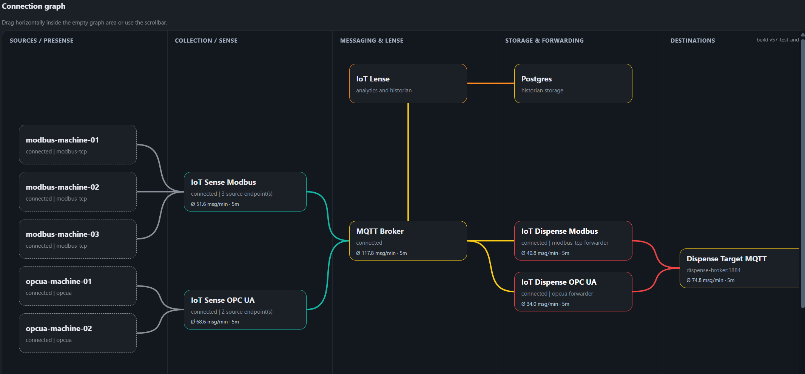

# OT.io

See [UI workflows](docs/ui-workflows.md) for configuration forms, simulator controls, graph navigation and the integrated PostgreSQL viewer. [Next beta release notes](docs/releases/next-beta/RELEASE_NOTES.md) summarize this release.

**OT.io is a private beta project. It is not production-ready. Use it in production at your own risk.**

I built OT.io as a small, modular connectivity and diagnostics platform for machine data. The goal is not to hide the data flow behind a giant black box. The goal is to make the path visible: source endpoint, collector, broker, historian, forwarder and target system.

If something breaks, IoT Lense should make it obvious where the flow stopped.



## What OT.io contains

| Module | Purpose |
|---|---|
| IoT Presense | Simulates Modbus TCP and OPC UA style endpoints for local demos and tests. |
| IoT Sense | Reads data from sources and publishes telemetry, status, health and errors. |
| MQTT Broker | Moves messages between modules. Mosquitto is used in the demo stack. |
| IoT Lense | Shows health, quick metrics, logs, configurations and the connection graph. |
| Postgres | Stores telemetry and health data for Lense. |
| IoT Dispense | Forwards selected data to downstream systems. The first target is another MQTT broker. |
| Protocol Lab | Native protocol adapters, Presense simulator controls and a shared testing UI connected to Lense and Sense. |

## Current beta capabilities

- local Docker Compose demo stack
- [Kubernetes deployment example](examples/05-kubernetes/README.md) with Kustomize, persistent storage and a kind smoke test
- [Helm chart example](examples/06-helm/README.md) with configurable images, credentials, storage and release lifecycle
- Raspberry Pi ARM deployment example
- Ansible control container for distributed rollout labs
- Modbus TCP source simulation
- OPC UA style source simulation
- OPC UA style subscription flow in Presense and Sense
- Modbus polling in Sense
- MQTT telemetry publishing
- central Lense dashboard
- connection graph with status colors and line styles
- Quick Metrics and Unified Namespace views
- protocol-specific configuration forms alongside the existing JSON workflow
- bounded read-only PostgreSQL queries, table previews and CSV extracts
- configuration snapshots where write-back is enabled
- Dispense forwarding to a target MQTT broker
- Mermaid documentation diagrams for Markdown rendering

## Quick start

The fastest demo is the local Docker Compose example.

Prerequisites: Docker with the Compose plugin, a running Docker daemon and internet access for the first build. The existing application images build with Go 1.26.8; Protocol Lab uses Go 1.27.1. Both run on Alpine 3.24.

```bash
cd examples/01-local-docker-compose
docker compose up --build
```

Open IoT Lense first:

```text
http://127.0.0.1:8000
```

You can also use the helper scripts from the repository root.

Linux and macOS:

```bash
bash scripts/start-local-docker-compose-demo.sh
```

Windows PowerShell:

```powershell
.\scripts\start-local-docker-compose-demo.cmd
```

## Examples

| Example | Purpose |
|---|---|
| [01 Local Docker Compose](examples/01-local-docker-compose/README.md) | Starts the full OT.io demo stack on one machine. |
| [02 Raspberry Pi ARM distributed](examples/02-raspberry-pi-arm-distributed/README.md) | Deploys the stack across several Raspberry Pis with an Ansible control container. |
| [03 Protocol Lab](examples/03-protocol-lab/README.md) | Native Modbus TCP/RTU tunnel and OPC UA simulators, MQTT/AMQP publishers, Sense and Lense in one stack. |
| [04 Device gateways](examples/04-device-gateways/README.md) | Connect existing S7, CIP, BACnet/IP, KNXnet/IP and IEC 104 devices through the lab adapters. |
| [05 Kubernetes](examples/05-kubernetes/README.md) | Deploy the Protocol Lab stack with Kustomize. |
| [06 Helm](examples/06-helm/README.md) | Deploy and configure the single-replica stack with Helm. |
| [07 Kubernetes HA](examples/07-kubernetes-ha/README.md) | Active/passive Sense and Lense, clustered MQTT and replicated PostgreSQL. |

The [protocol support matrix](docs/protocols.md) covers all requested protocol families. Ten IP adapters/samplers are integrated; physical-device drivers are marked experimental, and fieldbus gateways and missing native adapters are explicitly identified. The existing `opcua` source remains an HTTP demo; `lab-opcua-tcp` uses native OPC UA Binary.

## Try a failure scenario

Start the local example and stop one Sense instance:

```bash
docker stop iot-sense-opcua
```

Then refresh IoT Lense. The affected Sense node and its source nodes should become unavailable in the connection graph.

Start it again:

```bash
docker start iot-sense-opcua
```

## Sense protocol extensions

IoT Sense is structured so protocol-specific code lives below `apps/sense/internal/protocols`. The generic Sense runtime handles configuration, status, publishing, logs and UI. A new source protocol should normally add a reader or subscriber and register it, rather than duplicating the whole Sense application.

The current "OPC UA style" implementation uses HTTP JSON and streaming endpoints (`/read`, `/nodes`, `/subscribe`). It is a demo protocol, not a native OPC UA client/server implementation.

## Development and checks

Install Go 1.27.1 or newer and Node.js 24. The workspace selects Go 1.27.1 automatically when toolchain downloads are enabled.

```powershell
.\test.cmd
.\coverage.cmd
```

On Linux and macOS, run `bash scripts/test.sh`. The test runner executes all nine Go modules, three shared JavaScript suites and Kubernetes configuration checks. A plain `go test ./...` at the repository root does not cover this multi-module workspace.

The HTML coverage report is written to `coverage/coverage.html`. See [Testing](docs/testing.md) for static analysis, race detection and vulnerability scans, and the [September 2026 review](docs/quality/review-2026-09.md) for measured coverage and remaining gaps.

## Documentation

Start here:

- [Documentation overview](docs/README.md)
- [Architecture](docs/architecture.md)
- [Configuration and rollout guide](docs/configuration-rollout.md)
- [ARM and Raspberry Pi deployment](docs/arm-raspberry-pi.md)
- [IoT Presense](docs/presense.md)
- [IoT Sense](docs/sense.md)
- [IoT Lense](docs/lense.md)
- [IoT Dispense](docs/dispense.md)
- [Deployment](docs/deployment.md)
- [Extension guide](docs/extension-guide.md)
- [Testing](docs/testing.md)

### Extending OT.io

Start here when adding custom modules:

- [Extension guide](docs/extension-guide.md)
- [Custom Presense modules](docs/presense.md#writing-a-custom-presense-extension)
- [Custom Sense modules](docs/sense.md#writing-a-custom-sense-extension)
- [Custom Dispense modules](docs/dispense.md#writing-a-custom-dispense-extension)

## Roadmap ideas

Potential next steps:

- user authentication and role-based access
- TLS, certificates and encrypted broker communication
- broader secret rotation and per-connection credential management
- signed configuration changes
- better configuration approval workflows
- improved UI navigation and dashboards
- physical-device validation for the experimental S7, EtherNet/IP, BACnet/IP, KNXnet/IP and IEC 104 adapters
- PLC4Go based device and PLC simulations
- more target protocols, for example Kafka, NATS, HTTP APIs, databases and cloud endpoints
- stronger analytics, trend comparison and aggregations
- anomaly detection and AI-assisted diagnostics
- alerting and notification rules
- durable message queues, replay and stronger HA fencing
- agent onboarding workflow:
  - deploy a new Sense or Dispense instance
  - instance registers at Lense
  - Lense shows a pending onboarding request
  - operator approves the instance
  - optional temporary auto-approval window for lab environments
- configuration templates for common integration patterns
- shared transport abstraction beyond MQTT

## Production warning

This is currently a private beta project. The stack is built for local evaluation, demos and development. Production use requires additional work around authentication, authorization, certificates, encryption, secrets, backup, monitoring and hardening.


## Raspberry Pi ARM deployment notes

The distributed deployment transfers a compressed source bundle as the configured SSH user and deploys one Raspberry Pi at a time (`serial: 1`). It uses sudo for privileged operations such as creating `/opt/otio`, resetting the stack and running Docker Compose. See the [ARM deployment guide](docs/arm-raspberry-pi.md) for setup and troubleshooting.

### Kubernetes HA

[Example 07](examples/07-kubernetes-ha/README.md) covers active/passive Sense and Lense, clustered MQTT and replicated PostgreSQL with failover tests. This is an initial failover example with documented delivery and fencing limitations.
