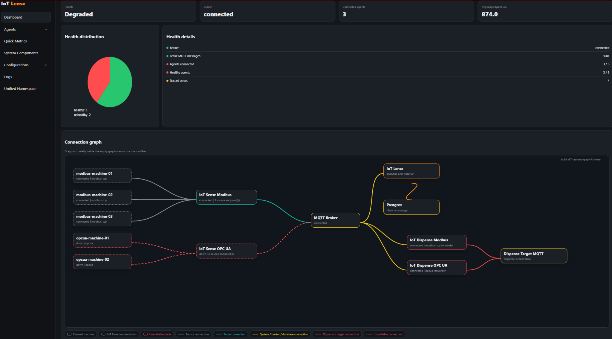

# OT.io

**OT.io is a private beta project. It is not production-ready. Use it in production at your own risk.**

I built OT.io as a small, modular connectivity and diagnostics platform for machine data. The goal is not to hide the data flow behind a giant black box. The goal is to make the path visible: source endpoint, collector, broker, historian, forwarder and target system.

If something breaks, IoT Lense should make it obvious where the flow stopped.



## What OT.io contains

| Module | Purpose |
|---|---|
| IoT Presense | Simulates Modbus TCP and OPC UA style endpoints for local demos and tests. |
| IoT Sense | Reads data from sources and publishes telemetry, status, health and errors. |
| MQTT Broker | Moves messages between modules. Mosquitto is used in the demo stack. |
| IoT Lense | Shows health, quick metrics, logs, configurations and the connection graph. |
| Postgres | Stores telemetry and health data for Lense. |
| IoT Dispense | Forwards selected data to downstream systems. The first target is another MQTT broker. |

## Current beta capabilities

- local Docker Compose demo stack
- Modbus TCP source simulation
- OPC UA style source simulation
- OPC UA style subscription flow in Presense and Sense
- Modbus polling in Sense
- MQTT telemetry publishing
- central Lense dashboard
- connection graph with status colors and line styles
- Quick Metrics and Unified Namespace views
- JSON-based configuration workflow
- configuration snapshots where write-back is enabled
- Dispense forwarding to a target MQTT broker
- Mermaid documentation diagrams for GitHub rendering

## Quick start

The local demo requires Docker and Docker Compose. The first build needs access to Docker Hub because the demo uses official base images.

Linux and macOS:

```bash
chmod +x scripts/*.sh
./scripts/start-demo.sh
```

Windows PowerShell:

```powershell
scripts/start-demo.ps1
```

The start script checks Docker, pulls the required base images and then starts the demo stack.

Manual start:

```bash
docker compose up --build
```

If Docker cannot resolve or reach Docker Hub, see:

- [Troubleshooting](docs/troubleshooting.md)

Open IoT Lense first:

```text
http://127.0.0.1:8000
```

Useful module URLs:

| Component | URL |
|---|---|
| IoT Lense | http://127.0.0.1:8000 |
| IoT Sense Modbus | http://127.0.0.1:8100 |
| IoT Sense OPC UA | http://127.0.0.1:8101 |
| IoT Dispense Modbus | http://127.0.0.1:8200 |
| IoT Dispense OPC UA | http://127.0.0.1:8201 |
| Presense Modbus 01 | http://127.0.0.1:8301 |
| Presense Modbus 02 | http://127.0.0.1:8302 |
| Presense Modbus 03 | http://127.0.0.1:8303 |
| Presense OPC UA 01 | http://127.0.0.1:4840 |
| Presense OPC UA 02 | http://127.0.0.1:4841 |


## Try a failure scenario

Stop one Sense instance:

```bash
docker stop iot-sense-opcua
```

Then refresh IoT Lense. The affected Sense node and its source nodes should become unavailable in the connection graph.

Start it again:

```bash
docker start iot-sense-opcua
```

## Sense protocol extensions

IoT Sense is structured so protocol-specific code lives below `apps/sense/internal/protocols`. The generic Sense runtime handles configuration, status, publishing, logs and UI. A new source protocol should normally add a reader or subscriber and register it, rather than duplicating the whole Sense application.

## Documentation

Start here:

- [Documentation overview](docs/README.md)
- [Architecture](docs/architecture.md)
- [Configuration and rollout guide](docs/configuration-rollout.md)
- [IoT Presense](docs/presense.md)
- [IoT Sense](docs/sense.md)
- [IoT Lense](docs/lense.md)
- [IoT Dispense](docs/dispense.md)
- [Deployment](docs/deployment.md)
- [Extension guide](docs/extension-guide.md)
- [Testing](docs/testing.md)

### Extending OT.io

Start here when adding custom modules:

- [Extension guide](docs/extension-guide.md)
- [Custom Presense modules](docs/presense.md#writing-a-custom-presense-extension)
- [Custom Sense modules](docs/sense.md#writing-a-custom-sense-extension)
- [Custom Dispense modules](docs/dispense.md#writing-a-custom-dispense-extension)

## Roadmap ideas

Potential next steps:

- user authentication and role-based access
- TLS, certificates and encrypted broker communication
- broker credentials and secret handling
- signed configuration changes
- better configuration approval workflows
- improved UI navigation and dashboards
- more source protocols, for example S7, EtherNet/IP, BACnet, HTTP polling and file-based ingestion
- more target protocols, for example Kafka, NATS, HTTP APIs, databases and cloud endpoints
- stronger analytics, trend comparison and aggregations
- anomaly detection and AI-assisted diagnostics
- alerting and notification rules
- Kubernetes support with Helm charts
- agent onboarding workflow:
  - deploy a new Sense or Dispense instance
  - instance registers at Lense
  - Lense shows a pending onboarding request
  - operator approves the instance
  - optional temporary auto-approval window for lab environments
- configuration templates for common integration patterns
- shared transport abstraction beyond MQTT

## Production warning

This is currently a private beta project. The stack is built for local evaluation, demos and development. Production use requires additional work around authentication, authorization, certificates, encryption, secrets, backup, monitoring and hardening.
