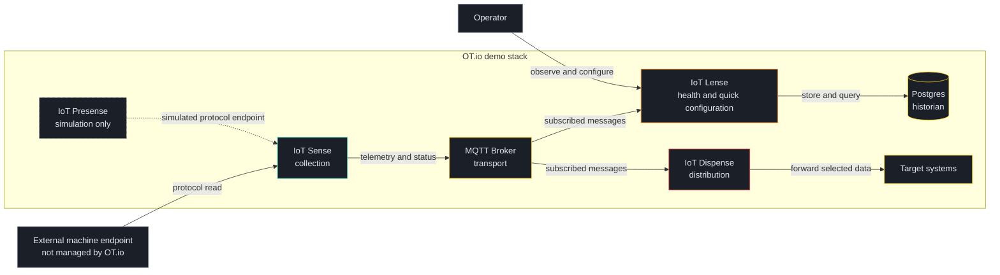
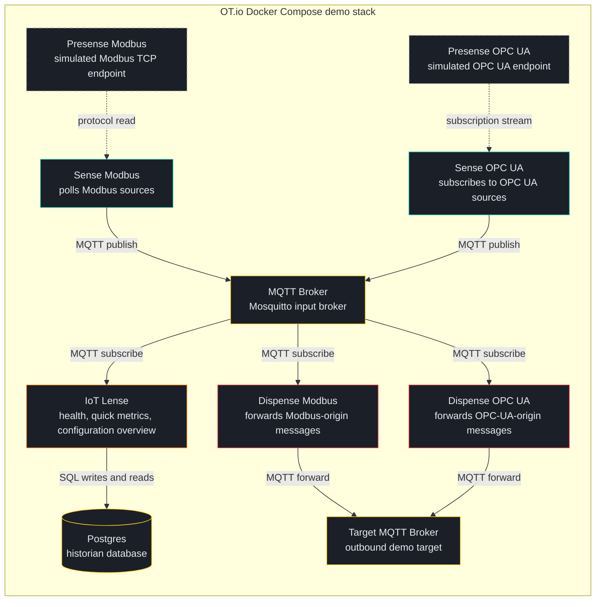
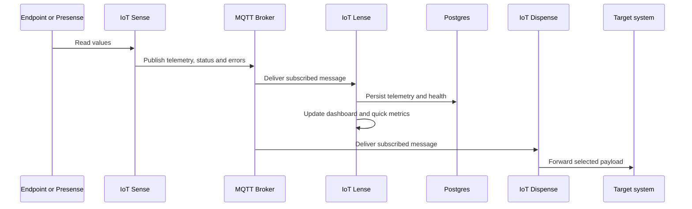
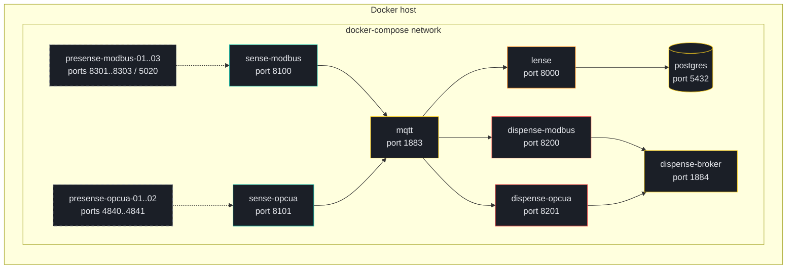

# OT.io Architecture

OT.io is a lightweight connectivity and diagnostics platform. It connects machine data to target systems and helps me find broken links quickly.

The documentation uses Mermaid diagrams directly in Markdown so GitHub can render the diagrams without a separate build step.

## Introduction and goals

OT.io provides a small modular stack for:

- simulating protocol endpoints for test scenarios
- collecting machine and simulator data
- transporting telemetry and health data through MQTT
- observing health and message flow
- configuring modules quickly
- forwarding selected data to target systems

The main design goals are:

- simple integration
- simple extension
- fast fault localization
- visible data flow
- reusable module and UI building blocks

## Context View

## Container View

## Runtime Flow

## Deployment View

## Extension Points

```mermaid
flowchart LR
    Source["Custom source endpoint"]
    Presense["Custom Presense module<br/>optional simulator"]
    Sense["Custom Sense module<br/>protocol collector"]
    Shared["Shared MQTT, topic and payload helpers"]
    Broker["MQTT Broker"]
    Lense["IoT Lense<br/>health and config visibility"]
    Dispense["Custom Dispense module<br/>outbound adapter"]
    Target["Target system"]

    Source -->|implement protocol reader| Sense
    Presense -.->|simulate protocol endpoint| Sense
    Sense -->|use topic and payload conventions| Shared
    Shared -->|publish| Broker
    Broker -->|observe| Lense
    Broker -->|subscribe| Dispense
    Dispense -->|implement target writer| Target

    classDef presense fill:#1b1f27,stroke:#8a9099,stroke-dasharray:5 5,color:#e7e9ee;
    classDef sense fill:#1b1f27,stroke:#14b8a6,color:#e7e9ee;
    classDef lense fill:#1b1f27,stroke:#ff8a1d,color:#e7e9ee;
    classDef dispense fill:#1b1f27,stroke:#ef4444,color:#e7e9ee;
    classDef system fill:#1b1f27,stroke:#ffd21f,color:#e7e9ee;
    classDef external fill:#1b1f27,stroke:#8a9099,color:#e7e9ee;

    class Presense presense;
    class Sense sense;
    class Lense lense;
    class Dispense dispense;
    class Broker,Shared,Target system;
    class Source external;
```

## OPC UA style subscriptions

The beta stack supports an OPC UA style subscription path between IoT Presense and IoT Sense. Presense exposes a streaming subscription endpoint and Sense can consume it with `readMode: "subscription"`.

This models subscription behavior for the demo stack. Security, certificates and encrypted real OPC UA sessions are planned later.

## Main Building Blocks

| Building block | Responsibility | Notes |
|---|---|---|
| IoT Presense | Simulates protocol endpoints | Used for demo and test scenarios only |
| IoT Sense | Reads source endpoints | Publishes telemetry, status and errors |
| MQTT Broker | Transports messages | Current default transport |
| IoT Lense | Shows health, quick metrics and configuration | Helps find the broken link quickly |
| Postgres | Stores telemetry and health data | Used by IoT Lense |
| IoT Dispense | Forwards selected messages | Sends data to target systems |
| Target systems | Receives forwarded data | External to OT.io |

## Real Machines and Presense Simulations

Real machines and Presense simulations are intentionally treated differently.

| Endpoint type | Shown in connection graph | Clickable | Visual style |
|---|---:|---:|---|
| Real external machine | Yes | No | Solid grey border |
| Presense simulation | Yes | Yes | Dashed grey border |
| OT.io component | Yes | Yes where applicable | Component color |

This keeps the graph useful without pretending that external machines are managed by OT.io.
