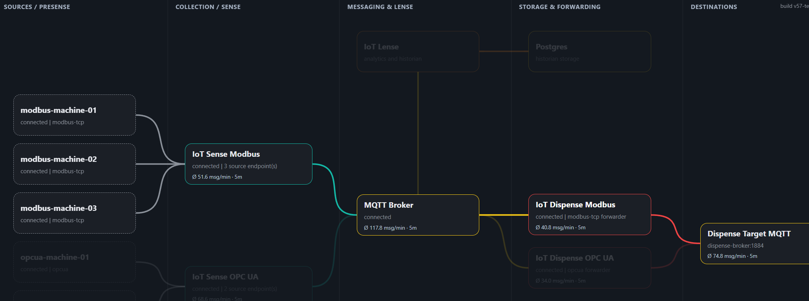
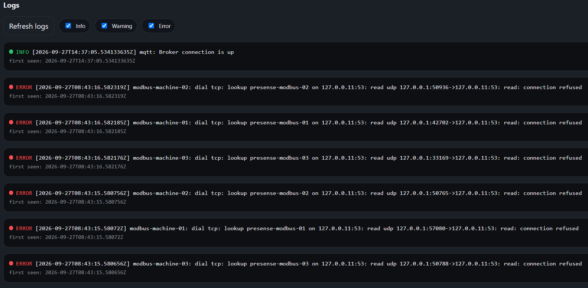
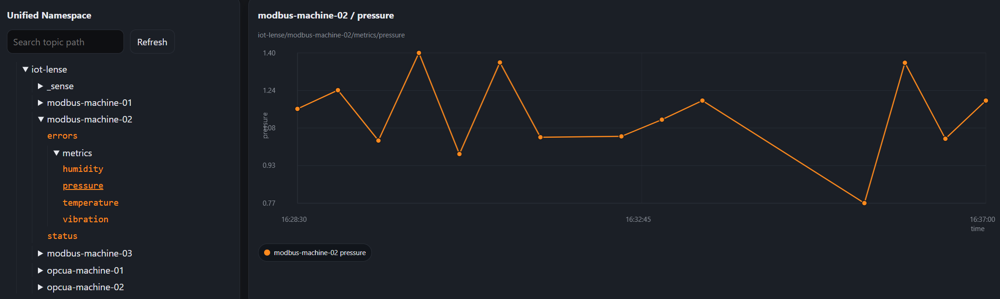
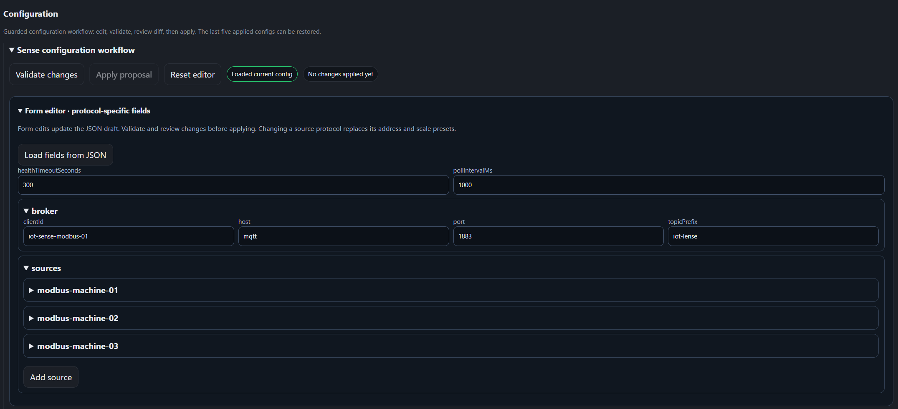
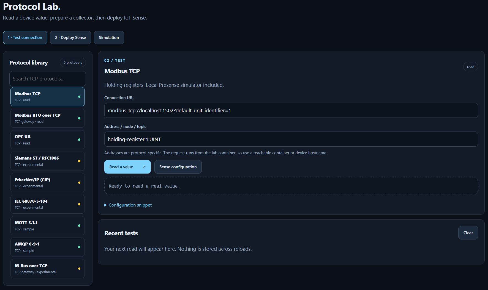
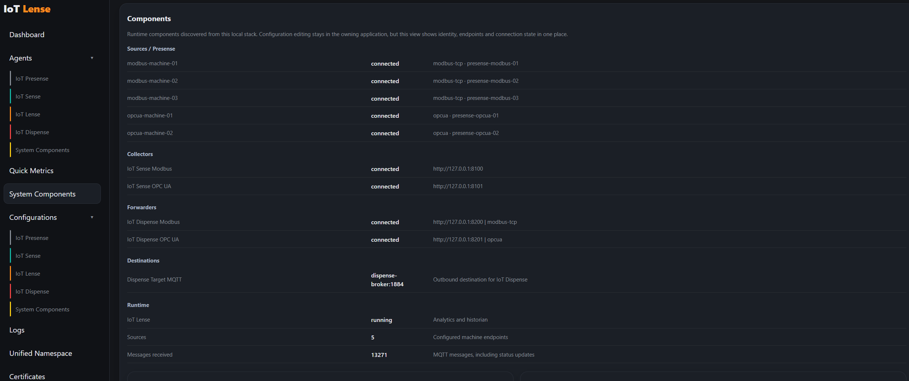
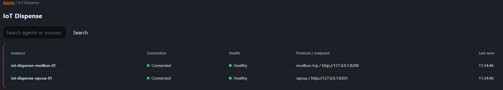
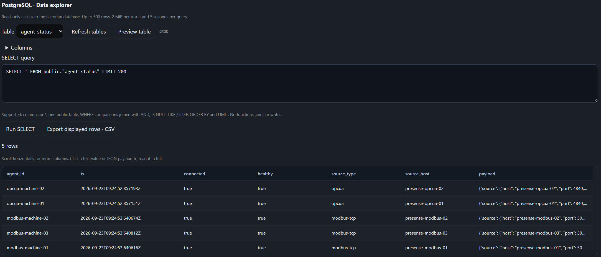

# UI configuration and connection graphs

Lense, Sense, Dispense and the legacy Presense UIs share a scrollable graph viewport. Drag the graph background horizontally or vertically, use the scrollbars, or focus the viewport and use the left/right arrow keys. Lense groups sources, collection, messaging, storage/forwarding and destinations into lanes; Lense sits above MQTT and connects directly to Postgres. Sense uses equally spaced source, collector and broker columns.

System Components groups components by role and displays broker/database connection details as compact facts. Connection charts collect actual observations while the page is open, retain up to 300 samples in browser storage and fit the observed time range. The first observation is necessarily a single point; subsequent polls extend the line, even when the state is unchanged. Gaps longer than two minutes are not connected. History is browser-local, not server-side monitoring history.

## Shared navigation and data-flow focus

Health summaries retain a compact pie chart beside the status facts. The shared UI renders the Lense and Sense charts at the same size.

Click or press Enter on a graph node to open the same actions in every application: **View in Lense**, **Configure in Lense**, and **Open instance UI** when an instance URL is configured. Presense shows its protocol/listening port on the source node and the collector assigned in the Lense topology. An unassigned source displays an explicit message instead of an invented collector. Dashed source borders identify Presense simulators; real devices use solid borders.

Hover or keyboard-focus a node to highlight its configured data flow and fade unrelated nodes and edges. Shared brokers retain the individual collector flows; they do not merge all branches. Moving out restores the graph. This is configured routing, not traffic tracing.

Instance UIs read navigation-only metadata from Lense's `GET /api/topology`. The endpoint excludes configuration bodies and supports cross-origin reads. Instance links carry the Lense base URL in the `lense` query parameter; direct local access defaults to the same browser hostname on port 8000. For another deployment address, open the instance through Lense or supply `?lense=https%3A%2F%2Flense.example%2F`. If topology is unavailable, local monitoring continues; cross-instance destinations require a reachable topology service.

Topics on Lense's agent detail page are direct links into Unified Namespace. Opening one expands its parent branches and selects its preview; the URL can be bookmarked.

## Forms and JSON

Open **Configuration**. The protocol-aware form is visible by default; **Advanced · JSON draft** retains the JSON editor. Form edits update the JSON draft; editing JSON also refreshes the open form. Source protocol selection changes connection and address presets. Expand **metrics** and review addresses, scaling and units: presets cannot infer a device's register map. Existing custom fields remain in the draft. Validation and application still use each application's workflow. Dispense's current configuration screen prepares drafts; its runtime write-back remains unavailable.

Sense namespace status topics show an explicit information message; error topics show source-specific errors or an empty state. Both clear the previous metric chart. Only metric topics display numeric history.

## Presense

The Modbus and legacy OPC UA HTTP demo instances expose `GET /api/config` and `PUT /api/config`. The form changes generator mode and base values in the running process. Choose **Validate changes**, review the proposed JSON, then **Apply proposal**. Background status refreshes do not overwrite drafts. If `OTIO_CONFIG_WRITE_TOKEN` is set, enter it in the token field. Unknown fields, invalid modes, out-of-range values and changes to the fixed listener protocol are rejected by the server.

Set `PRESENSE_CONFIG_PATH` to save settings across restarts. Example 01 mounts an individual configuration volume per simulator. With no path, settings last only until process restart. Host and listener ports still come from startup environment variables. **Host reachable from Sense** changes the copied example, not the listener.

**Copy Sense source** exports this instance's actual register/node mapping, scaling and port. Add the object to Sense's `sources` array, using a hostname reachable from the Sense process (Compose service names inside the stack).

The connection panel identifies the legacy instance's fixed protocol; choosing a protocol no longer unexpectedly navigates away. The form shows the values relevant to that protocol.

## Compact navigation

Dashboard status uses a compact strip. Agents and Configurations use comparable rows with restrained link colors; offline or unhealthy agents sort first. The instance logo returns to its dashboard. Graph nodes open the same keyboard-accessible detail dialog in every instance; **Open details** continues to the component's local page.

## Protocol Lab: test, deploy, simulate

**Test connection** shows implemented TCP adapters. UDP and hardware-only entries remain documented in the protocol matrix but do not clutter the selector. Testing an external device does not start a simulator.

**Deploy Sense** generates a complete collector configuration, Compose file, SSH/SCP transfer commands and values for the [single-collector Helm chart](../deploy/helm/otio-sense/README.md). Use an existing MQTT broker. All `lab-*` sources require the gateway service; the generated deployment includes it without simulators. Build images locally or use tags already available in your registry. Choose the target CPU architecture when building. Review addresses from the target network. The generator does not execute commands or deploy anything.

**Simulation** starts or stops only the selected listener. A plain Lab process starts with none. Integrated examples explicitly enable their five existing sources with `LAB_SIMULATORS`. S7/RFC1006 and M-Bus over TCP are optional read-only fixtures: S7 exposes temperature as REAL in DB1 bytes 0–3; M-Bus exposes one CI72 / DIF02 / VIF5A flow-temperature record at primary address 1. These are limited fixtures, not full PLC or meter emulators. Modbus RTU over TCP carries RTU framing through a TCP gateway; it does not access serial hardware. Wireless M-Bus is not implemented.

The simulators share one signal generator. MQTT/AMQP require configured broker URLs and explicit activation. **Copy Sense source** adapts endpoint, address and scale to the selected simulator.

## PostgreSQL data explorer

Open **Agents → System Components → Postgres**, or <http://localhost:8000/#agents/postgres>. The same explorer is available below **System Components**. It uses Lense's existing historian database connection; no extra database client, container or login is needed. It inherits access to Lense's UI/API and does not introduce a separate authentication boundary.

Select a public table, inspect its column names/types, and choose **Preview table**, or edit a query:

```sql
SELECT ts, agent_id, metric_name, metric_value
FROM metric_events
WHERE agent_id = 'modbus-machine-01' AND metric_value > 25
ORDER BY ts DESC
LIMIT 200;
```

Supported syntax is intentionally limited to `SELECT` columns or `*`, one table in `public`, comparisons (`=`, `!=`, `<>`, `<`, `>`, `<=`, `>=`, `LIKE`, `ILIKE`, `IS [NOT] NULL`) joined with `AND`, column-based `ORDER BY`, and `LIMIT`. Values are bound as parameters. Joins, arbitrary functions, comments, CTEs, additional statements and writes are rejected. The server also uses a read-only transaction and a four-second PostgreSQL statement timeout within a five-second request deadline.

The default limit is 200 rows, the maximum 500, and result data is capped at 2 MiB. Truncated results are labelled. **Export displayed rows · CSV** exports exactly the current result, including column headers; it does not export the entire database. Nulls become empty CSV fields; spreadsheet formula-like text is prefixed with an apostrophe. Use narrower filters for extracts. Editing the query clears the old result and disables export until the next successful read.

Result columns keep readable widths and scroll horizontally inside the table. Headers stay visible when scrolling down. Long text is shortened visually; click a text cell to open its complete value, with JSON formatted over multiple lines. Close the detail view with **Close** or Escape. CSV exports retain the complete values, including text shortened in the table.

## Example 01 startup

The PostgreSQL data explorer is integrated in Lense; no separate database-client container is needed.

From the repository root:

```powershell
docker compose -f examples/01-local-docker-compose/docker-compose.yml up --build -d
```

Open Lense at <http://localhost:8000>, then **Protocol Lab**, or use <http://localhost:8000/protocols>. Example 01 now includes Protocol Lab and RabbitMQ. If the Lab is unavailable, the Lense route displays a service-unavailable page with startup instructions. Reload existing browser tabs after rebuilding to load the shared UI scripts.


Health distribution sits at the top left with one segment per status check; hover a segment for its label and value. Status facts wrap into compact rows. Sense details in Lense show the latest 50 metric messages from that collector's configured sources. EOF log entries explain that the connection closed before a complete response; they list possible causes without claiming a diagnosis.

Presense shows its running protocol as a read-only field and links to Protocol Lab for other simulators. The Lab has a return link to Lense. Deploy Sense keeps device address, VM login and broker visible, with advanced image settings collapsed. Invalid deployment fields are highlighted in red and receive focus. Certificate setup and expiry warnings are described in [Certificates](certificates.md).


## Current interface screenshots

Graph, Logs, Unified Namespace, Configuration and Protocol Lab screenshots were supplied from the local stack on 27 September 2026. Component, agent and database screenshots are from 23 September. Example log errors illustrate diagnostics and are not a statement about current system health.

### Connection graph

Nodes share a detail dialog for opening the instance or its Lense view. Dashed outlines identify Presense simulations.


Hovering or focusing a node highlights its data flow and dims unrelated components.



### Logs and Unified Namespace

Filter logs by severity and inspect source-specific errors. Historical connection failures remain visible after a service recovers.



Select a metric topic to see its history; selecting errors opens the corresponding error panel.



### Configuration and Protocol Lab

Use protocol-aware forms to prepare a draft, validate it, review the diff and apply it.



Protocol Lab separates connection testing, deployment preparation and optional simulation.



### Components and agents

System Components uses compact rows to keep identities, status and addresses visible together.



Agents use the same row structure across module families.



### PostgreSQL explorer

Table results preserve readable column widths. Long payloads open in a detail view; CSV exports retain their full content.



## Status tooltips and namespace errors

Health segments show an immediate tooltip with the corresponding status label and value. Keyboard focus shows all checks; Escape dismisses the tooltip. EOF log rows use the same visible explanation tooltip, also accessible through keyboard focus.

Selecting an **errors** leaf opens a source-specific **Errors** panel in both Lense and Sense. With no matching entries, the panel explicitly reports that no errors are available instead of leaving the previous preview visible. Lense includes the last 24 hours of recorded errors and current component issues. The MQTT topic keeps its original `errors` name; it is not renamed to a different topic.

## Finding the updated Lab

Open **Protocol Lab** from Lense, or visit `/protocols` on the Lense host. The Lab opens through Lense's proxy and **← IoT Lense** returns to the same host and port. Static Lab responses disable caching to avoid mixed UI versions after a rebuild.

1. **Test connection**: choose OPC UA (or another TCP adapter), enter the device address and read a value. OPC UA certificate profiles are managed under **Lense → Certificates**.
2. **Deploy Sense**: verify the separate device address, enter VM login and MQTT broker. Collector name and image tags are under **Advanced**. Invalid fields turn red and receive focus.
3. **Prepare VM installation**: download the generated configuration files; follow the displayed image build, image transfer and remote start commands. Helm instructions are available separately. The page prepares installation files; it does not deploy them automatically or provide a prebuilt binary download.

Presense's protocol field is intentionally read-only because the running instance has a fixed listener. **Choose another simulator in Protocol Lab** is the actionable link. Certificate rotation and expiry monitoring are described in [Certificates](certificates.md).


## Message flow in connection graphs

Sense, Dispense and MQTT broker nodes display **Ø N msg/min · 5m**: messages counted in the last five minutes divided by five. Click a node and choose **Live Messages** to open its message view in Lense. Large message hover tooltips are no longer shown. The graph remains clickable and flow highlighting continues to work.

Sense and Dispense count successful publications, including any status/error publications by Sense. The main broker shows MQTT traffic observed by Lense's configured subscription; the target broker shows successful publications from its configured Dispense instances. These are observed OT.io flows, not broker-wide statistics or delivery acknowledgments. With shared MQTT subscriptions, a Lense replica observes only its assigned messages.

Every instance graph obtains the same Lense `/api/graph-traffic` snapshot at most once per minute. Lense caches upstream collection for one minute across clients, with three-second request timeouts. Counters use 300 one-second buckets in memory, require no database queries, reset on process restart and retain a bounded buffer of the latest 50 messages. During the first five minutes the average includes the empty pre-start portion of the window. Missing/unreachable instances show **—**, not a misleading zero. A connected instance with no messages in the window shows **0.0**; its older messages remain available in Live Messages with timestamps. Cross-origin graph access is limited to same-host instances and explicitly configured instance origins. A reachable Lense is required for the shared overview.

**Live Messages** is shared by Sense, Dispense and broker graph menus in every instance. It polls only the selected source every five seconds while the page is visible, with Pause/Resume and manual Refresh. Use **Topic filter** for a case-sensitive text search within the latest 50 messages. Filtering is immediate, works while paused, and stays active across refreshes without additional requests. The match count and an explicit empty state show when no buffered topic matches. The **Available topics** dropdown lists distinct topics from the latest 50 messages and combines with the text filter. Its exact selection survives refreshes, including when that topic leaves the buffer. Payloads (up to 2 KiB) appear directly below each topic without expanding rows. This process-local snapshot is not a lossless stream or historian: bursts can replace messages between refreshes, and restarts clear the buffer. Unreachable publishers are identified explicitly. Target brokers combine the latest successful publications from their configured Dispense instances. The existing historian “Last 50 messages” view remains separate.
