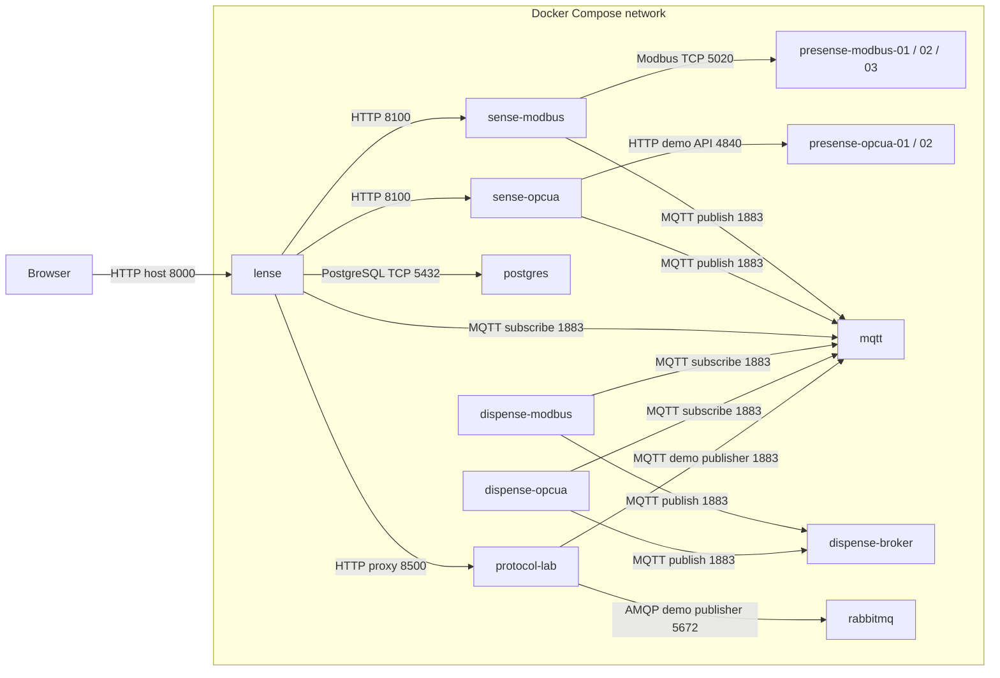

# Example 01: Local Docker Compose

This example starts the full OT.io demo stack on one machine.

## Containers and communication

Arrows point from the connection initiator to the listening service; responses and subscribed messages travel back over that connection. Edge labels use **container ports**. Each box represents a container; repeated instances are grouped.



| Access from the host | Host port → container port |
|---|---|
| Lense | 8000 → 8000 |
| Sense Modbus / OPC UA | 8100 → 8100 / 8101 → 8100 |
| Dispense Modbus / OPC UA | 8200 → 8200 / 8201 → 8201 |
| Three Modbus simulators | 5020, 5021, 5022 → 5020 each |
| Modbus simulator UIs | 8301, 8302, 8303 → 8300 each |
| Two OPC UA-style HTTP demos | 4840, 4841 → 4840 each |
| Input / target MQTT | 1883 → 1883 / 1884 → 1883 |
| Input / target MQTT WebSocket listeners | 9001 → 9001 / 9002 → 9001 |
| PostgreSQL | 5432 → 5432 |
| Protocol Lab HTTP / Modbus / RTU tunnel / native OPC UA | 8500 / 1502 / 1503 / 4842 → same port, loopback only |
| RabbitMQ AMQP | 5672 → 5672, loopback only |

The legacy OPC UA-style containers use an HTTP demo protocol on 4840. Native OPC UA Binary is provided separately by Protocol Lab on 4842. Its published 1102 (S7) and 1504 (M-Bus) ports require opt-in simulators; publishing a port does not start a listener. The default collectors read the legacy Presense containers; adding Lab sources requires updating their configuration.

Protocol Lab and RabbitMQ are included. Open <http://localhost:8000/protocols> for native protocol simulation and copyable Sense source examples. Presense settings are persisted in individual configuration volumes. See [UI workflows](../../docs/ui-workflows.md) for forms, graph navigation and simulator configuration.

## Prerequisites

- Docker
- Docker Compose plugin
- Network access to Docker Hub for the first build

## Start

Run from this folder:

```bash
docker compose up --build
```

Or run from the repository root:

```bash
bash scripts/start-local-docker-compose-demo.sh
```

On Windows PowerShell from the repository root:

```powershell
.\scripts\start-local-docker-compose-demo.cmd
```

## Open the UI

```text
http://127.0.0.1:8000
```

## Useful URLs

| Component | URL |
|---|---|
| IoT Lense | http://127.0.0.1:8000 |
| PostgreSQL data explorer | http://127.0.0.1:8000/#agents/postgres |
| IoT Sense Modbus | http://127.0.0.1:8100 |
| IoT Sense OPC UA | http://127.0.0.1:8101 |
| IoT Dispense Modbus | http://127.0.0.1:8200 |
| IoT Dispense OPC UA | http://127.0.0.1:8201 |
| Presense Modbus 01 | http://127.0.0.1:8301 |
| Presense Modbus 02 | http://127.0.0.1:8302 |
| Presense Modbus 03 | http://127.0.0.1:8303 |
| Presense OPC UA 01 | http://127.0.0.1:4840 |
| Presense OPC UA 02 | http://127.0.0.1:4841 |

## Browse PostgreSQL tables

Open <http://localhost:8000/#agents/postgres> or **System Components → PostgreSQL · Data explorer** in Lense. No separate container or database login is needed. Select a table to preview rows and inspect column types. Run a limited SELECT query and export the displayed result to CSV. See [the query examples and limits](../../docs/ui-workflows.md#postgresql-data-explorer).

If you started Adminer with an earlier version, stop and remove just that container with `docker rm -f 01-local-docker-compose-adminer-1` (from the repository root). PostgreSQL data volumes remain intact.
## Failure test

Stop one Sense instance:

```bash
docker stop iot-sense-opcua
```

Refresh IoT Lense. The affected Sense node and its source nodes should become unavailable in the connection graph.

Start it again:

```bash
docker start iot-sense-opcua
```
