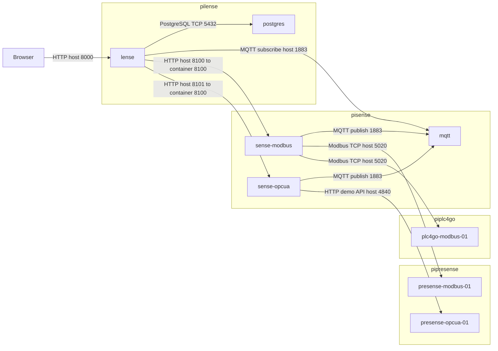

# OT.io Raspberry Pi ARM distributed example

This example deploys the original OT.io application to four Raspberry Pis. It does not replace the existing Lense UI, Quick Metrics, Agent pages, Configuration pages, Logs, Unified Namespace, or the original connection graph behavior.

## Containers across the four hosts

Each subgraph is a separate Raspberry Pi and Compose network. Cross-host connections use addresses from your inventory and published host ports; container names resolve only within their own Compose network. Arrows show connection initiation.



Additional management endpoints are Presense Modbus at host 8301 → container 8300, PLC4Go at 8400 → 8400, and the OPC UA-style HTTP demo at 4840 → 4840. Ansible deploys to all four hosts over SSH (TCP 22 by default, configurable in inventory); SSH is a deployment path, not the telemetry transport. The MQTT WebSocket listener is exposed on 9001, and PostgreSQL on 5432. No Dispense or Protocol Lab container is deployed by these node stacks.

## Target layout

| Raspberry Pi | Host | Role |
| --- | --- | --- |
| `pipresense` | configured in the local inventory | Presense Modbus and Presense OPC UA simulation |
| `piplc4go` | configured in the local inventory | PLC4Go-style Modbus machine endpoint |
| `pisense` | configured in the local inventory | MQTT broker, Sense Modbus, Sense OPC UA |
| `pilense` | configured in the local inventory | Lense and the Postgres database required by Lense |

## Why Ansible

The laptop should not manually copy files to every Pi. Ansible is used as a small deployment control plane:

1. connect to each Pi by SSH,
2. check Python, Docker, Docker Compose and ARM architecture,
3. copy the original OT.io source code to `/opt/otio/repo`,
4. copy the node-specific Compose stack to `/opt/otio/docker-compose.yml`,
5. render the runtime configuration for Sense and Lense,
6. run `docker compose up -d --build` on each Pi.

## Files to edit

For this ready-to-run package, `deploy/ansible/secrets/local-inventory.yml` is already filled for the local lab. If you start from a clean checkout, copy `deploy/ansible/secrets/local-inventory.yml.example` to `deploy/ansible/secrets/local-inventory.yml` and edit the host addresses and credentials.

Use these files when the topology changes:

| File | Purpose |
| --- | --- |
| `deploy/ansible/secrets/local-inventory.yml` | Local SSH users, SSH passwords, sudo passwords and host addresses. This file is intentionally not committed. |
| `deploy/ansible/inventory.ini` | Non-secret fallback inventory without passwords. |
| `deploy/ansible/templates/sense-modbus-config.json.j2` | Sources read by Sense Modbus. |
| `deploy/ansible/templates/sense-opcua-config.json.j2` | Sources read by Sense OPC UA. |
| `deploy/ansible/templates/lense-topology.json.j2` | Lense topology used by the original Lense UI. |
| `examples/02-raspberry-pi-arm-distributed/node-stacks/*/docker-compose.yml` | Compose stack for each Pi. |

## Prerequisites

On the laptop:

- Docker Desktop
- access to the same network as the Raspberry Pis

On every Raspberry Pi:

- SSH enabled
- Python 3 installed
- Docker installed
- Docker Compose plugin installed
- the configured SSH user can run Docker and sudo

## Build the Ansible control container

Run this from the repository root:

```powershell
docker build -t otio-ansible:arm-distributed .\deploy\ansible
```

## Lab network safety

This example is intended for a trusted Raspberry Pi lab network. The UIs, MQTT broker and Postgres port are reachable from the LAN, and the demo Mosquitto configuration allows anonymous clients.

On shared networks, set `OTIO_CONFIG_WRITE_TOKEN` in the rendered `.env` before deployment. The Sense UI and the Lense remote configuration view will ask for that token before applying configuration changes.

## Reset the deployment on all Pis

```powershell
$repo = (Get-Location).Path
docker run --rm -it -v "${repo}:/workspace" otio-ansible:arm-distributed deploy/ansible/reset.yml
```

The reset playbook removes the OT.io Compose stacks, known OT.io containers, known OT.io images, known OT.io volumes, `/opt/otio`, and the optional systemd service.

## Deploy

```powershell
$repo = (Get-Location).Path
docker run --rm -it -v "${repo}:/workspace" otio-ansible:arm-distributed
```

## Test from the laptop

```powershell
$pipresense = "pipresense.local"
$piplc4go = "piplc4go.local"
$pisense = "pisense.local"
$pilense = "pilense.local"

Invoke-WebRequest "http://${pipresense}:8301/api/status"
Invoke-WebRequest "http://${pipresense}:4840/health"
Invoke-WebRequest "http://${piplc4go}:8400/health"
Invoke-WebRequest "http://${pisense}:8100/api/status"
Invoke-WebRequest "http://${pisense}:8101/api/status"
Invoke-WebRequest "http://${pilense}:8000/api/summary"
Test-NetConnection $pisense -Port 1883
```

Open Lense:

```text
http://pilense.local:8000
```

Original Lense routes:

```text
http://pilense.local:8000/#dashboard
http://pilense.local:8000/#agents
http://pilense.local:8000/#analytics
http://pilense.local:8000/#components
http://pilense.local:8000/#configurations
http://pilense.local:8000/#logs
http://pilense.local:8000/#uns
```

Note: the original Quick Metrics route is `#analytics`, not `#metrics`.

## Check containers on the Pis

```powershell
$sshUser = "your-ssh-user"
ssh "${sshUser}@${pipresense}" "docker ps --format 'table {{.Names}}	{{.Status}}	{{.Ports}}'"
ssh "${sshUser}@${piplc4go}" "docker ps --format 'table {{.Names}}	{{.Status}}	{{.Ports}}'"
ssh "${sshUser}@${pisense}" "docker ps --format 'table {{.Names}}	{{.Status}}	{{.Ports}}'"
ssh "${sshUser}@${pilense}" "docker ps --format 'table {{.Names}}	{{.Status}}	{{.Ports}}'"
```

Expected result:

- `pipresense`: `presense-modbus-01`, `presense-opcua-01`
- `piplc4go`: `plc4go-modbus-01`
- `pisense`: `iot-broker`, `iot-sense-modbus`, `iot-sense-opcua`
- `pilense`: `iot-lense`, `iot-lense-db`

## Broker test

The broker lives on `pisense`.

```powershell
Test-NetConnection $pisense -Port 1883
```

A successful TCP test means the broker port is reachable from the laptop. Lense itself also reports broker state on the dashboard after it connects and receives messages.

## Resilience behavior

The distributed setup does not depend on a fixed startup order. Sense retries unavailable sources continuously. When a source is unavailable, Sense publishes the current source status as disconnected and unhealthy. When the source becomes reachable again, Sense publishes a healthy status again and the normal data flow resumes.

Lense uses two paths for current status:

- MQTT status messages from Sense.
- The Sense `/api/status` endpoint as a fallback status probe.

This means Lense can recover its view even if it starts after an initial source failure or if a transient startup error was missed over MQTT. Historic errors remain available in the logs, but the dashboard health is based on the current retained status and the current Sense API state.

The MQTT status topics are retained so that a restarted Lense instance immediately receives the last known status for each source.
