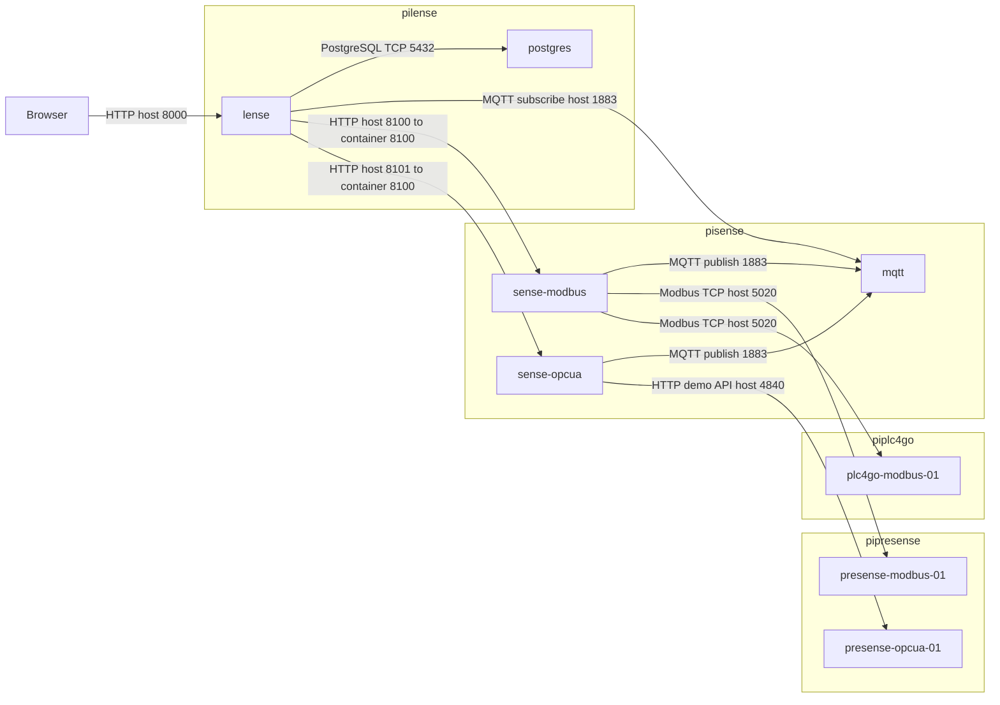

# Node stacks

Each folder contains the Docker Compose stack copied to the matching Raspberry Pi.

## Containers across the four hosts

Each subgraph is a separate Raspberry Pi and Compose network. Cross-host connections use addresses from your inventory and published host ports; container names resolve only within their own Compose network. Arrows show connection initiation.

Additional management endpoints are Presense Modbus at host 8301 → container 8300, PLC4Go at 8400 → 8400, and the OPC UA-style HTTP demo at 4840 → 4840. Ansible deploys to all four hosts over SSH (TCP 22 by default, configurable in inventory); SSH is a deployment path, not the telemetry transport. The MQTT WebSocket listener is exposed on 9001, and PostgreSQL on 5432. No Dispense or Protocol Lab container is deployed by these node stacks.

- `pipresense`: Presense Modbus and Presense OPC UA simulators
- `piplc4go`: PLC4Go-style Modbus machine endpoint
- `pisense`: MQTT broker and Sense collectors
- `pilense`: Lense and the Postgres database required by Lense

Do not start these files directly on the laptop. They are copied and started by Ansible on the target nodes.
