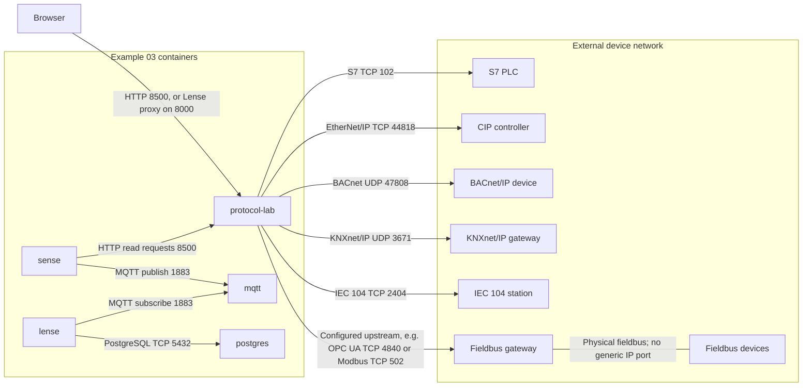

# Connecting existing devices and fieldbus gateways

## From containers to physical devices

This example reuses Example 03; it does not deploy extra PLCs or hardware gateways. Arrows show connections initiated by the containers. Device ports below are the catalog presets and must match the actual device configuration.

The Docker host/container network must route to the device endpoints. Publishing a local simulator port does not make an external device reachable. For a gateway that publishes MQTT, configure a broker read instead: the gateway publishes to its broker and Protocol Lab subscribes there. Device adapters and fieldbus gateways shown are alternatives, not prerequisites to run the demo.

Start [Example 03](../03-protocol-lab/README.md), then open Protocol Lab. Select an adapter, enter your device's reachable IP address and protocol-specific address, and run **Read a value**. The request runs from the lab container, not from your browser. For services on the Docker Desktop host, use `host.docker.internal`.

Use **Sense configuration** to generate a source entry, merge it into the Sense JSON configuration and validate/apply it in Sense. The full broker configuration and at least one source are required. A copied source is not applied automatically.

| Device | Adapter | Example address |
|---|---|---|
| S7 PLC with S7 access enabled | `lab-s7` | `%DB1:0:REAL` |
| CIP controller with symbolic tag access | `lab-ethernet-ip` | `%Temperature:REAL` |
| BACnet/IP device | `lab-bacnet-ip` | `0,1/85` (analog input 1, present value) |
| KNXnet/IP gateway | `lab-knxnet-ip` | `1/2/3:DPT_Value_Temp` |
| IEC 104 station | `lab-iec-60870-5-104` | `1/1` (common ASDU address / IOA) |

These drivers are experimental integrations of the pinned Apache PLC4Go revision; device interoperability is not established by the local demo tests. Change addresses, data types, rack/slot and gateway settings to match your installation. BACnet/IP and KNXnet/IP use UDP and may require network routing or host networking; the default bridge demo does not provide broadcast discovery.

PROFIBUS, CAN/CANopen, J1939, IO-Link, wired HART, M-Bus/Wireless M-Bus and AS-i require appropriate masters or gateways. Configure their *actual upstream* interface as OPC UA, MQTT, Modbus, etc. A CAN-to-MQTT gateway is an MQTT source carrying CAN-derived values, not native CAN support.

PROFINET RT/IRT and EtherCAT require suitable Ethernet stacks and hardware. HART-IP, DNP3/TCP and IEC 61850 MMS are not currently implemented. See the full [protocol matrix](../../docs/protocols.md).
