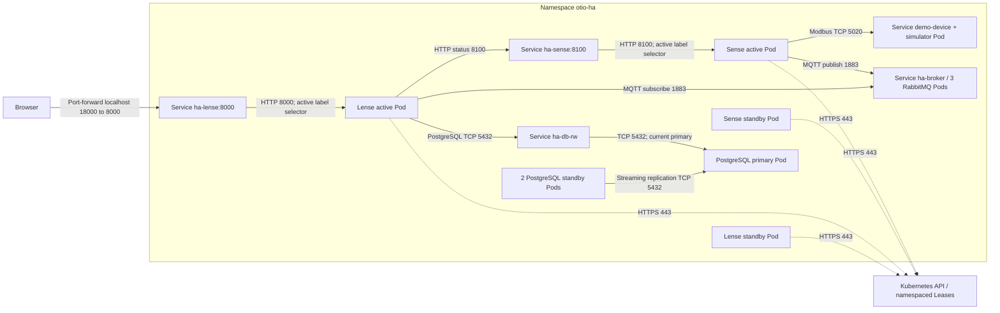

# Example 07 — Kubernetes HA (active/passive)

This separate Helm example covers **Sense, Lense, MQTT and PostgreSQL**. It keeps the existing Compose and single-replica Helm examples unchanged.

## HA Pods and communication

These names assume release `ha` in namespace `otio-ha`. Solid arrows show application connections to listening ports. Dashed arrows show election/control traffic. Each application Deployment has two Pods; only the elected Pod runs the Sense/Lense child process.



The Sense UI can also be forwarded from localhost 18100 to Service `ha-sense:8100`. The HA supervisor exposes readiness/liveness on Pod port 8099 for kubelet probes; it is not an application UI Service. Standbys participate in election but do not collect or ingest until takeover. Application Services select the elected Pod using `otio.io/active=true`.

The operators manage RabbitMQ clustering, database replication and their persistent volumes; their internal control connections are omitted from this application diagram. PostgreSQL requires one synchronous standby to acknowledge commits. The demo device has one Pod and is outside the HA guarantee. Port-forward sessions must be restarted if their selected Pod disappears.

| Component | Arrangement |
|---|---|
| Sense | Two pods on different workers; one collector owns a Kubernetes Lease |
| Lense | Two pods on different workers; one historian/UI owns its own Lease |
| MQTT | Three RabbitMQ nodes, MQTT plugin, operator-managed cluster and persistent disks |
| PostgreSQL | Three CloudNativePG instances, automatic primary election, one required synchronous standby |

Mosquitto remains the broker in the existing examples. Multiple independent Mosquitto pods would not form a cluster; this example uses RabbitMQ specifically for clustered MQTT. AMQP is not used by Sense or Lense here. Credentials are generated by the operators and passed to the applications through Secrets.

## Boundaries

This is a failover example, **not an exactly-once or zero-loss pipeline**. Sense/Lense currently use MQTT QoS 0. Samples sent during disconnection, takeover or database write failure may be lost; there is no replay/outbox. The database replication protects committed database records, not messages which never reached it. Dispense is excluded: its buffer is an in-memory chart history, and failed forwarding is dropped, not retried from durable storage.

The supervisor uses a 30-second Lease, a 15-second renewal deadline and 3-second retries. It kills the child when leadership is lost and only the active application's pod is a Service endpoint. Failover takes time for lease expiry, app startup, probes and broker reconnect; there is no fixed recovery-time guarantee. Kubernetes client-go leader election is not fencing: long process pauses, node partitions and clock-rate problems can cause overlapping activity. This example does not certify those failure modes. A production deployment requiring strict exclusivity needs fencing and idempotent delivery/storage.

Both application pods are Ready when healthy. Only the elected leader receives the `otio.io/active=true` label and is selected by its Service. Pod labels are cleared before election and on normal leadership loss; the UID is checked before each patch. Namespaced RBAC permits Lease get/update and pod label patching. A PDB keeps at least one healthy application pod and two broker pods. A UI session and in-memory chart/status caches reset on Lense takeover; PostgreSQL history remains. No active-active load balancing is claimed.

## Local setup (PowerShell, repository root)

Requires Docker, kind 0.31, kubectl, Helm 3 and enough Docker memory (allow about 8 GiB for this demo). The four-node kind cluster has three worker failure domains but still shares one computer and one Docker engine. It cannot demonstrate physical-host resilience. Real HA needs independent workers, a highly available Kubernetes control plane, suitable storage, and backups. The example creates cluster-wide operators in this dedicated test cluster.

```powershell
kind create cluster --name otio-ha --config examples/07-kubernetes-ha/kind.yaml
kubectl config use-context kind-otio-ha
kubectl apply -f https://github.com/cert-manager/cert-manager/releases/download/v1.21.2/cert-manager.yaml
kubectl -n cert-manager rollout status deployment/cert-manager-webhook --timeout=180s
kubectl apply --server-side -f https://github.com/cloudnative-pg/cloudnative-pg/releases/download/v1.28.4/cnpg-1.28.4.yaml
kubectl apply -f https://github.com/rabbitmq/cluster-operator/releases/download/v2.23.0/cluster-operator.yml
kubectl -n cnpg-system rollout status deployment/cnpg-controller-manager --timeout=180s
kubectl -n rabbitmq-system rollout status deployment/rabbitmq-cluster-operator --timeout=180s

foreach ($app in @('sense', 'lense', 'presense-modbus')) {
  docker build -t "otio/${app}:ha" -f "apps/$app/Dockerfile" .
  if ($LASTEXITCODE -ne 0) { throw "Image build failed: $app" }
  kind load docker-image --name otio-ha "otio/${app}:ha"
}
kubectl create namespace otio-ha
kubectl -n otio-ha apply -f examples/07-kubernetes-ha/demo-device.yaml
helm upgrade --install ha deploy/helm/otio-ha -n otio-ha
kubectl -n otio-ha wait cluster/ha-db --for=condition=Ready --timeout=600s
kubectl -n otio-ha wait rabbitmqcluster/ha-broker --for=condition=AllReplicasReady --timeout=600s
kubectl -n otio-ha get pods -o wide
```

The `demo-device` is a single Modbus simulator standing in for a physical machine; it is deliberately outside the HA guarantee. For real devices omit it and set `sourceHost`, `sourcePort`, `sourceUnitId` in chart values. The chart is an initial single-source HA case; change the shared `config.json` template to add sources. Both pods use the same read-only ConfigMap. UI configuration writes return an explicit explanation; edit Helm configuration and run `helm upgrade` instead. The configuration checksum restarts both replicas. Rolling updates keep healthy standbys available. Replacing the current leader still causes a lease-takeover gap; zero-downtime upgrades are not implemented. Inspect the Lease, active endpoint and data flow in addition to Deployment readiness.

For existing clusters have an administrator install compatible operators first. `storageClass` is optional when there is a default StorageClass; database and broker each need three independent volumes. Do not expose this lab's plain MQTT endpoint to an untrusted network. Add network policy, authenticated ingress/TLS and tested backup/restore before production use. Operator versions are pinned for repeatability; maintain them with their supported patch releases.

## Open the UI

Run each forwarding command in a separate terminal after an active pod is Ready:

```powershell
kubectl -n otio-ha port-forward service/ha-lense 18000:8000
kubectl -n otio-ha port-forward service/ha-sense 18100:8100
```

Open http://localhost:18000 and http://localhost:18100. In the PostgreSQL viewer query `SELECT * FROM metric_events ORDER BY id DESC LIMIT 20`. Port-forward attaches to one pod; restart it after that pod fails. In-cluster Services select the replacement automatically; use an ingress/load balancer for a stable external endpoint.

## Failover exercises

Use the provided script only against the disposable example. It deletes one running application pod at a time, waits for a different pod UID to own the Lease and become the Service endpoint, and verifies new metric rows arrive again. It then deletes a broker pod and the current database primary, checking data flow after each failure. It does not test partitions, total cluster loss, disk destruction or lossless delivery.

```powershell
./examples/07-kubernetes-ha/test-failover.ps1 -Context kind-otio-ha
```

Do not delete PVCs to simulate ordinary pod failures. Helm uninstall and operator removal are not a backup strategy; keep data backups separately. When finished with the disposable local cluster:

```powershell
kind delete cluster --name otio-ha
```

## References

- [Kubernetes client-go election and fencing limitations](https://pkg.go.dev/k8s.io/client-go/tools/leaderelection)
- [RabbitMQ Cluster Operator](https://www.rabbitmq.com/kubernetes/operator/using-operator)
- [CloudNativePG replication](https://cloudnative-pg.io/docs/1.28/replication/)

## Validation

See [the local validation record](VALIDATION.md) for the exercised failures and limitations. A graceful PostgreSQL pod deletion can take about three minutes with the operator's default smart-shutdown window; the failover test allows four minutes per check.
