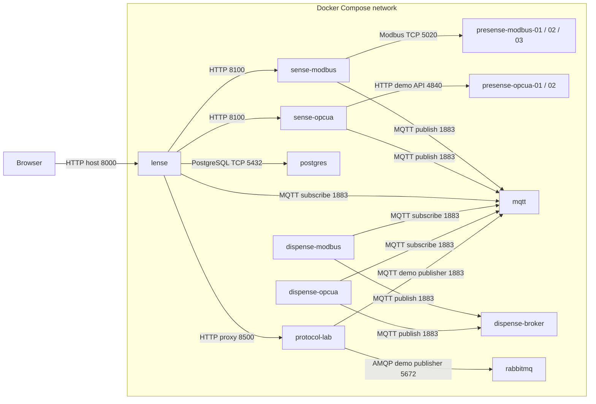

# Docker Compose Example

The root `docker-compose.yml` is the recommended first way to run OT.io.

## Containers and communication

Arrows point from the connection initiator to the listening service; responses and subscribed messages travel back over that connection. Edge labels use **container ports**. Each box represents a container; repeated instances are grouped.



| Access from the host | Host port → container port |
|---|---|
| Lense | 8000 → 8000 |
| Sense Modbus / OPC UA | 8100 → 8100 / 8101 → 8100 |
| Dispense Modbus / OPC UA | 8200 → 8200 / 8201 → 8201 |
| Three Modbus simulators | 5020, 5021, 5022 → 5020 each |
| Modbus simulator UIs | 8301, 8302, 8303 → 8300 each |
| Two OPC UA-style HTTP demos | 4840, 4841 → 4840 each |
| Input / target MQTT | 1883 → 1883 / 1884 → 1883 |
| Input / target MQTT WebSocket listeners | 9001 → 9001 / 9002 → 9001 |
| PostgreSQL | 5432 → 5432 |
| Protocol Lab HTTP / Modbus / RTU tunnel / native OPC UA | 8500 / 1502 / 1503 / 4842 → same port, loopback only |
| RabbitMQ AMQP | 5672 → 5672, loopback only |

The legacy OPC UA-style containers use an HTTP demo protocol on 4840. Native OPC UA Binary is provided separately by Protocol Lab on 4842. Its published 1102 (S7) and 1504 (M-Bus) ports require opt-in simulators; publishing a port does not start a listener. The default collectors read the legacy Presense containers; adding Lab sources requires updating their configuration.

It starts:

- Mosquitto as the input MQTT broker
- Mosquitto as the target MQTT broker for Dispense
- Postgres as historian database
- A small read-only PostgreSQL data explorer inside Lense at <http://localhost:8000/#agents/postgres>
- three Modbus Presense simulators
- two OPC UA style Presense simulators
- Sense Modbus in polling mode
- Sense OPC UA in subscription mode
- Lense as central health and configuration view
- Dispense Modbus and Dispense OPC UA as forwarding modules

## Start

```bash
docker compose up --build
```

## First checks

1. open IoT Lense at http://127.0.0.1:8000
2. check the connection graph
3. open IoT Sense Modbus at http://127.0.0.1:8100
4. open IoT Sense OPC UA at http://127.0.0.1:8101
5. open IoT Dispense OPC UA at http://127.0.0.1:8201

## Test an outage

```bash
docker stop iot-sense-opcua
```

Lense should mark the OPC UA Sense path and its source nodes as unavailable.

Start it again:

```bash
docker start iot-sense-opcua
```

## Switch OPC UA Sense back to polling

Edit `apps/sense/config-opcua/config.json` and change each OPC UA source:

```json
"readMode": "poll"
```

Then restart the Sense OPC UA container:

```bash
docker restart iot-sense-opcua
```

## Connect a real endpoint

1. Edit the Sense configuration.
2. Replace the Presense `host` and `port` with the real endpoint.
3. Update `apps/lense/config/topology.json` so the graph knows the new source.
4. Restart the affected Sense instance.

Real external endpoints should be visible in Lense, but they should not be clickable because they are not managed OT.io modules.
